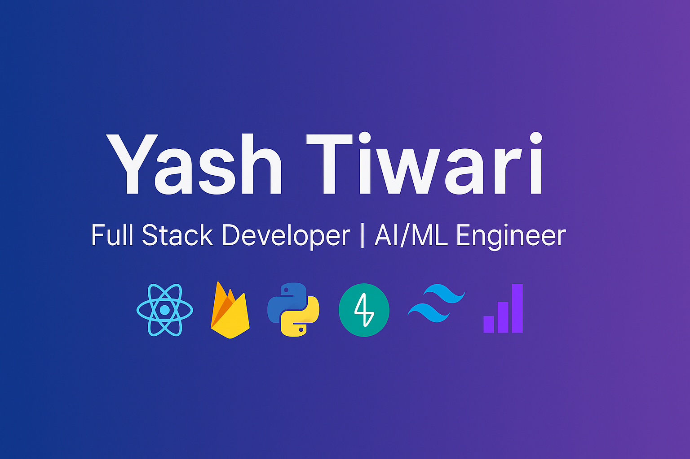

  

<h1 align="center">Hi 👋, I'm Yash Tiwari</h1>
<h3 align="center">Full Stack Developer | Aspiring AI/ML Engineer</h3>

---

---

## 🚀 About Me
- 💻 Software Developer Intern at **TECHstile** (Jan 2025 – Jun 2025).
- 🌱 Learning **AI Agents, Machine Learning, and Full Stack Development**.
- 🔗 **Live Project:** [Udyam Leap v2](https://udyam-leap-v2.web.app).
- ⚡ Passionate about **AI, Blockchain, and building products that scale**.

---

## 🛠 Tech Stack

  

---

## 📌 Featured Projects

### [🚀 Udyam Leap v2](https://udyam-leap-v2.web.app)
**Entrepreneurial Action Planner** – A full-stack planner for aspiring entrepreneurs.  
- **Stack:** React, Firebase, Firestore, Replit  
- **Highlights:** Real-time database, secure auth, hosted on Firebase.  

### [🤖 AI-Powered Sentiment Analyzer](https://github.com/yashtiwari750/Sentiment-Analyzer)
**ML model for sentiment classification.**  
- **Stack:** Python, pandas, scikit-learn  
- **Highlights:** TF-IDF, Logistic Regression, text preprocessing.

---

## 📊 GitHub Stats

  
  

---

## 🌱 Contribution Activity

  

---

## 🌐 Let's Connect

  
  

